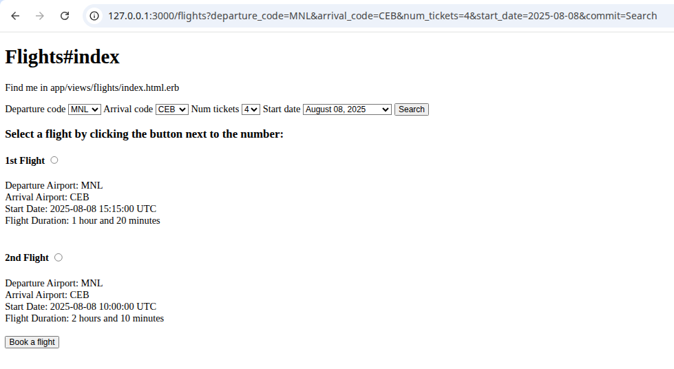
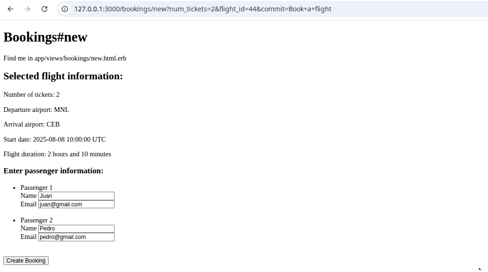
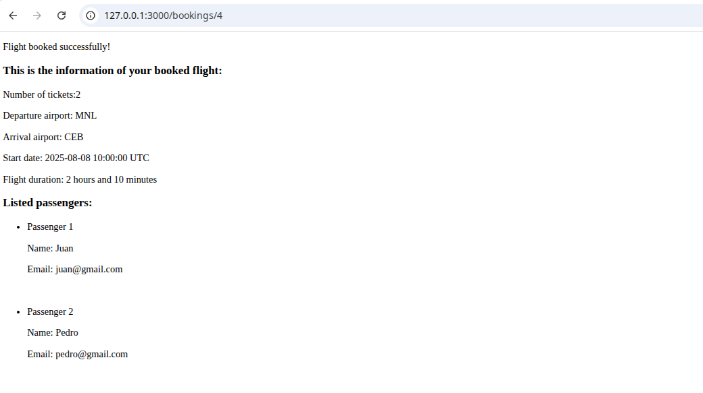

# Project: Flight Booker

This project is based on the [Ruby on Rails course of The Odin Project, Flight Booker](https://www.theodinproject.com/lessons/ruby-on-rails-flight-booker).

This is about tackling with more advanced forms like populating dropdown menus, radio buttons, working with nested attributes, complex user orders (booking flights), and integration of billing information (I have yet to find out how integrating billing information works).

## Learning Outcomes

- Focused mostly on building complex forms. This includes using `#fields_for` so I can have nested attributes, where forms may require to have multiple rendered form fields in a single form to prevent user submitting multiple times.
- That said, I had to use `accepts_nested_attributes_for :passengers` as seen in the Booking model.
- I learned how to permit the params for these nested attributes.
- The advanced forms also allowed me to figure out how to work with hidden fields, date objects and date formats, as well as producing results with a basic search form and passing these params to different views.

## Screenshots

### Root page

### New Booking

### Booked flight

